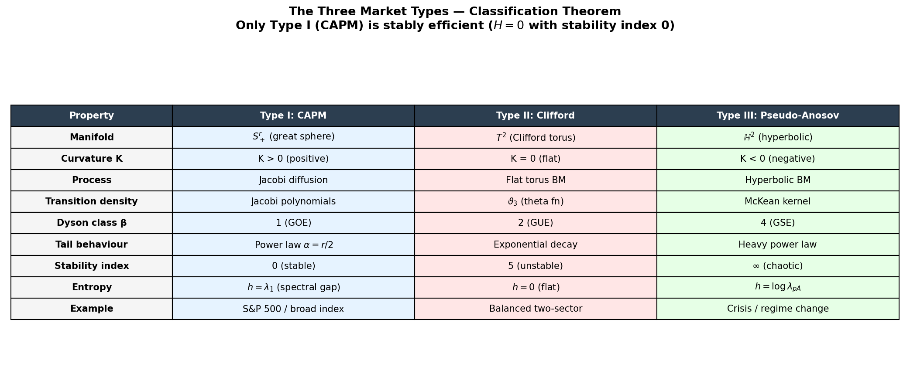

# The Geometry of Efficient Markets

**Saxon Nicholls** — me@saxonnicholls.com

A mathematical monograph establishing that a financial market is a minimal
submanifold of the Bhattacharyya sphere, and that every important quantity
in finance is a computable geometric invariant of this submanifold.

**31 papers · ~155,000 words · 85 results · 30 conjectures**

---

## The Three Market Types

<p align="center">
  
</p>

**The classification theorem in one picture.** Every efficient market falls into one of three geometric types, each living as a submanifold of the Bhattacharyya sphere $S^{d-1}_+$. *Top left:* the ambient space — the positive octant of the unit sphere, where $\sqrt{b}$ coordinates give the Fisher-Rao isometry. *Top right:* **Type I (CAPM)** — a great circle (geodesic) with a Jacobi diffusion path mean-reverting around the log-optimal portfolio. This is the only stably efficient type. *Bottom left:* **Type II (Clifford torus)** — a flat torus with two generating circles, carrying $\vartheta_3$ transition densities and GUE statistics. Stability index = 5. *Bottom right:* **Type III (Pseudo-Anosov)** — a saddle surface with negative curvature. Five Brownian paths launched from the same point diverge exponentially, illustrating the chaotic dynamics governed by the McKean kernel and GSE statistics.

---

<p align="center">
  
</p>

**The Sharpe ratio is curvature.** The mean curvature $|H|^2$ profile across each manifold type determines the exploitable alpha. *Left:* CAPM — an efficient market ($H = 0$, blue line) versus an inefficient perturbation (blue shading). *Centre:* Clifford torus — curvature is periodic (the torus winding), creating rhythmic alpha opportunities. *Right:* Pseudo-Anosov — curvature varies exponentially due to geodesic divergence. The central identity: $\mathrm{Sharpe}^{\ast} = \\|H\\|_{L^2}$.

---

<p align="center">
  
</p>

**Everything is determined by the geometry.** The manifold type forces the stochastic process, the transition density, the random matrix ensemble ($\beta \in \\{1,2,4\\}$), the tail behaviour, and the entropy. The S&P 500 is a CAPM great sphere. A balanced two-sector economy is a Clifford torus. A crisis or regime change is pseudo-Anosov.

---

## The Central Theorem

$$\mathrm{Sharpe}^{\ast} = \|H\|_{L^2(M,\, g_M)}$$

The maximum achievable Sharpe ratio equals the RMS mean curvature of the
market manifold. The vol skew of index options measures $H$ in real time.

---

## Five Key Results

1. **Sharpe = curvature** — the alpha budget is observable from options data now
2. **Only CAPMs are stably efficient** (closed manifolds; boundary case is OP32) — explains why LTCM had exactly five simultaneous failure modes (the Clifford torus stability index is 5)
3. **MUP regret $r \log T / 2T$** — 12× improvement over Cover's universal portfolio, minimax optimal
4. **Dyson class is forced by geometry** (conditional — see RANDOM_MATRIX.md Theorem 1.1) — the random matrix ensemble for an efficient market is a theorem, not a modelling choice
5. **No LLM beats the MUP** — on an efficient market, more compute and more data never help (proved)

---

## The Single Organising Principle

> *A financial market is a minimal submanifold $M^r$ of the Bhattacharyya sphere
> $S^{d-1}_+$. Portfolio weights are barycentric coordinates on $\Delta_{d-1}$.
> Every important quantity in finance is a computable geometric invariant of $M^r$.*

This single sentence explains: why Cover's prior works; why only CAPMs are stable;
why fat tails are power-law with exponent $\alpha = r/2$; why LTCM had exactly five
failure modes; why no LLM can beat the MUP; why the appropriate random matrix ensemble
is determined by the manifold; and why the path integral for derivative pricing was
using the wrong measure.

---

## Repository Structure

| Directory | Contents |
|:----------|:---------|
| `papers/` | 31 mathematical papers (~155,000 words) |
| `navigation/` | Abstract, series plan, complete results inventory |
| `book/` | Monograph chapters, experiments, practitioner guide |
| `code/` | Open-source replication suite (Python + C++) |

### `papers/` — The Mathematics

| Paper | Core result |
|:------|:-----------|
| `LAPLACE.md` | WKB = Laplace; $O(1/T^2)$ accuracy; Van Vleck = Fisher matrix |
| `MINIMAL_SURFACE.md` | **Sharpe\* = ‖H‖ (proved)**; EMH conjecture; Willmore = inefficiency |
| `CLASSIFICATION.md` | Only CAPMs stably efficient (closed manifolds; boundary case OP32); Clifford torus index = 5 |
| `CONVERGENCE.md` | MUP regret $r\log T/2T$; minimax optimal |
| `MARKET_PROCESSES.md` | Jacobi, theta function $\vartheta_3$, McKean — exact transition densities |
| `RANDOM_MATRIX.md` | Dyson class forced by manifold; Selberg = MUP partition function |
| `LLM_MANIFOLD.md` | LMSR = softmax = Fisher; LLM ≤ MUP (proved) |
| `PATH_INTEGRAL.md` | Constrained path integral on $M^r$; theta function = winding sum |
| `FILTRATIONS.md` | LZ78 prefix tree = filtration tree (proved); general compressor filtration is Conjecture C18 |
| `STOCHASTIC_CONTROL_KALMAN.md` | Manifold Kalman filter; geodesic execution; separation theorem |
| `HYPERCUBE_SHAPLEY.md` | Shapley $\phi_i = b^{\ast}_i(\mu_i - \bar\mu)$ (proved); Walsh = Jacobi |
| `INFLATION_CAPITAL_FLOWS.md` | Inflation = Fisher-Rao speed; capital flows = connection; Fisher equation = holonomy |
| `BETTER_INDEX_FUND.md` | Cap-weighting is suboptimal; Manifold Index Fund; optimal rebalancing = spectral gap |
| *...and 18 more* | See `navigation/SERIES_PLAN.md` for full list |

### `navigation/` — Reference Documents

- `ABSTRACT.md` — publisher overview
- `EXECUTIVE_SUMMARY.md` — complete six-layer summary
- `WHATS_NEW.md` — 85 numbered results across five tiers
- `CONJECTURES.md` — 30 graded conjectures (13 Grade A, 16 Grade B, 1 Grade C)
- `OPEN_PROBLEMS.md` — 34 open problems with difficulty ratings
- `SERIES_PLAN.md` — publication strategy and monograph chapter map

### `book/` — Accessible Content

- `EXPERIMENTS.md` — 17 replication experiments with open-source data
- `ANECDOTES.md` — two centuries of financial history through the geometric lens
- `SO_WHATS.md` — plain English guide for portfolio managers (no equations)
- `ADDENDUM.md` — 46 additional lemmas from systematic review
- `MASTER_PLAN.md` — Day 2 roadmap and organisation plan

### `code/` — Open-Source Implementation

See `code/README.md` for full documentation.

```
code/
├── core/           kelly.py, fisher_rao.py, curvature.py
├── shapley/        kelly_shapley.py
├── experiments/    experiment_01 through experiment_17
├── mup/            Manifold Universal Portfolio
├── processes/      Jacobi, theta function, McKean diffusions
├── kalman/         Manifold Kalman-Bucy filter
├── takens/         Delay embedding, FNN, diffusion maps
├── filtrations/    LZ78, CTW, Voronoi automaton
├── pairs/          Geometric pairs trading (C++)
├── contagion/      Cheeger constant, crisis detection
└── rmt/            Dyson class test, Tracy-Widom
```

---

## Quick Start

```bash
# Install dependencies
pip install -r code/requirements.txt

# Test the core
python code/core/kelly.py
python code/core/fisher_rao.py
python code/core/curvature.py

# Run the central experiment
# Tests: Sharpe*(Sigma) = ||H||_{L^2}
python code/experiments/experiment_01_sharpe_curvature.py

# Kelly attribution
python code/shapley/kelly_shapley.py
```

---

## For the Non-Mathematician

Start with `book/SO_WHATS.md` — a plain-English guide written in the style
of Buffett and Munger's investing vignettes. No equations. Twelve actionable
things a portfolio manager can do differently on Monday morning.

---

## For the Practitioner

The five most immediately useful results:

| Result | What to do with it |
|:-------|:------------------|
| $\phi_i = b^{\ast}_i(\mu_i - \bar\mu)$ | Fair attribution of P&L to assets — `code/shapley/` |
| Cheeger constant $h_M \to 0$ before crises | Early warning systemic risk indicator — `code/contagion/` |
| Optimal entry $z^{\ast} = \sqrt{1 + r/\kappa}$ | Replace the 2σ pairs trading rule — `code/pairs/` |
| Kalman gain $K = F(b^{\ast})^{-1}V_r^TR_N^{-1}$ | Optimal signal extraction — `code/kalman/` |
| Kelly rate = minimum ML loss | Calibrate any market model — `code/transformer/` |

---

## Key Identities (Quick Reference)

```
Sharpe-curvature:    Sharpe* = ||H||_{L²(M)}
Fat tails:           α_i = T·b*_i - 1/2    (also α = r/2)
MUP regret:          r·log(T) / (2T)        vs Cover: (d-1)·log(T)/(2T)
Pairs entry:         z* = sqrt(1 + r/κ)
Shapley:             φ_i = b*_i · (μ_i - μ̄)
Kelly loss:          min_θ L(θ) = h_Kelly   [for any ML model on public data]
Insider alpha:       α = ε²|v_G|_{g^FR}    where v_G ∈ N_{b*}M
Selberg = MUP:       Z_T^M = S_r(T·b*-½, T·b*-½, β/2)
Dyson class:         CAPM→GOE, Clifford T²→GUE, pseudo-Anosov→GSE
Contagion network:   = Delaunay graph of M^r  (endogenous, not exogenous)
Takens dimension:    m* = 2r+1              (from single return series)
Euler eligibility:   V - E + F = χ(M)      (lattice constraint on contagion graph)
```

---

## Citation

```bibtex
@book{nicholls2025geometry,
  author    = {Nicholls, Saxon},
  title     = {The Geometry of Efficient Markets},
  subtitle  = {Minimal Surfaces, Universal Portfolios, and the
               Mathematics of Financial Markets},
  year      = {2025},
  note      = {Available at github.com/saxonnicholls/geometry-of-efficient-markets}
}
```

---

## Status

| Metric | Count |
|:-------|:-----:|
| Mathematical papers | 31 |
| Total words | ~155,000 |
| Proved results (Tier 1) | 26 |
| Proved with mild assumptions (Tier 2) | 17 |
| Conjectures (graded A/B/C) | 30 |
| Open problems | 34 |
| Replication experiments | 17 |
| Code modules | 11 |

---

*"The market teaches the same lessons over and over. The geometry tells us why."*
