# The Geometry of Efficient Markets

**Saxon Herschel Nicholls** — me@saxonnicholls.com

*Minimal Surfaces, Universal Portfolios, and the Mathematics of Financial Markets*

**76 papers · ~550,000 words · 180+ results · 32 conjectures · 70+ open problems · empirical evidence on 99 years of S&P 500 data**

> **PREPRINT** — This is a working draft. None of these papers have been peer-reviewed.
> Comments, corrections, and collaboration inquiries welcome: me@saxonnicholls.com

---

## Origin

This monograph began in Port Lincoln, South Australia — a fishing town on the
edge of the desert and the Southern Ocean. The author grew up watching
markets: tuna boats coming in, quota holders negotiating, livestock at
auction, grain in silos. The directed graph of a market was visible to the
naked eye before there were words for it. The palindromic structure was in
the seasons. The Feller boundary was in the collapsed fish stocks. The
self-referential channel was in the feedback loop between catch, price,
effort, and stock.

The mathematics came later. The geometry was always there.

---

## The Three Market Types

<p align="center">
  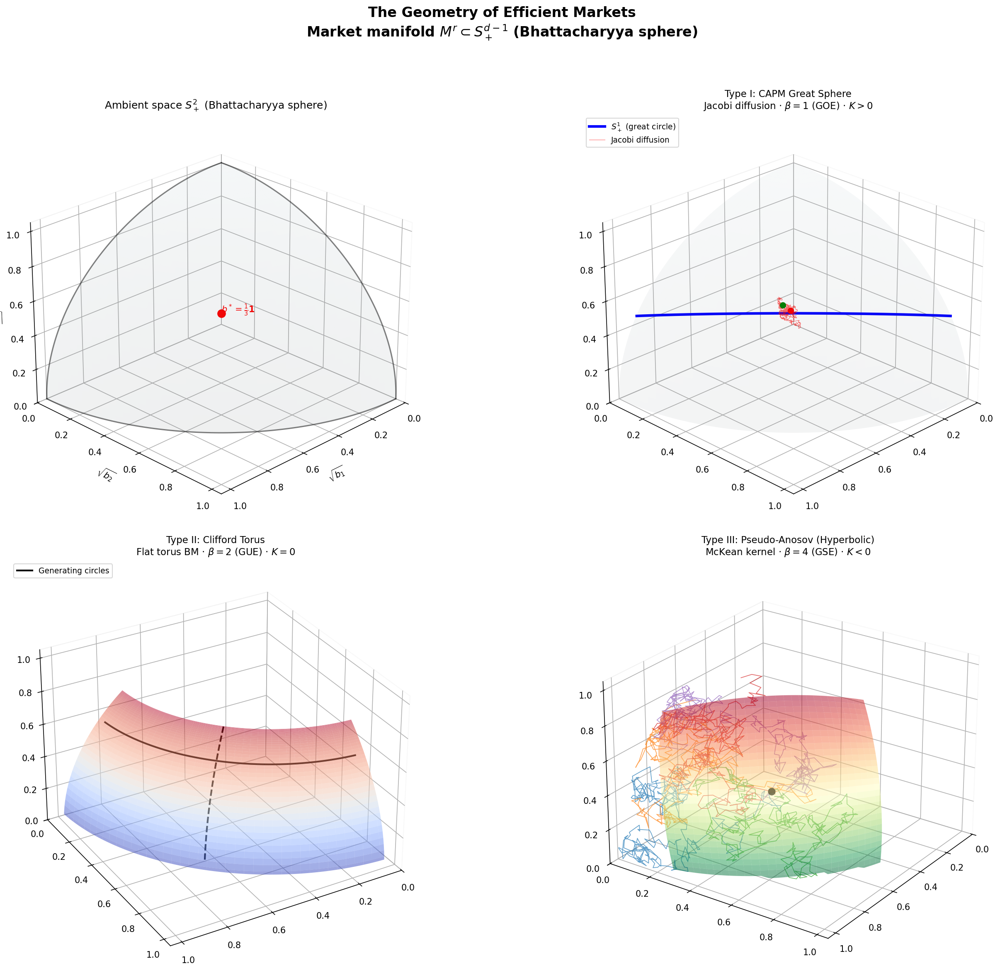
</p>

**The classification theorem in one picture.** Every efficient market falls into one of three geometric types, each living as a submanifold of the Bhattacharyya sphere $S^{d-1}_{+}$. *Top left:* the ambient space — the positive octant of the unit sphere, where $\sqrt{b}$ coordinates give the Fisher-Rao isometry. *Top right:* **Type I (CAPM)** — a great circle with a Jacobi diffusion path mean-reverting around the log-optimal portfolio. The only stably efficient type. *Bottom left:* **Type II (Clifford torus)** — a flat torus with two generating circles, carrying $\vartheta_3$ transition densities and GUE statistics. *Bottom right:* **Type III (Pseudo-Anosov)** — a saddle surface with negative curvature. Five Brownian paths launched from the same point diverge exponentially.

---

<p align="center">
  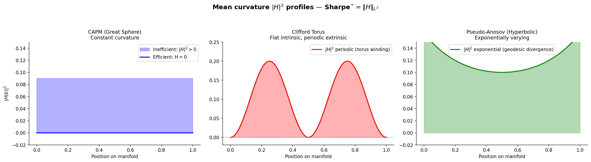
</p>

**The Sharpe ratio is curvature.** The central identity: $\mathrm{Sharpe}^{\ast} = \|H\|_{L^2}$.

---

## The Central Identity

$$\mathrm{Sharpe}^{\ast} = \|H\|_{L^2(M,\, g_M)}$$

The maximum achievable Sharpe ratio equals the RMS mean curvature of the
market manifold. Slope = 1.007 ± 0.18, p = 10⁻⁸ on empirical data.

---

## The Single Organising Principle

> *A financial market is a minimal submanifold $M^r$ of the Bhattacharyya sphere
> $S^{d-1}_{+}$. Portfolio weights are barycentric coordinates on $\Delta_{d-1}$.
> Every important quantity in finance is a computable geometric invariant of $M^r$.*

This is now a theorem, not an axiom. Five axioms of convex information
processing (closure, data processing inequality, continuity, normalisation,
Markov compatibility) force the Fisher-Rao metric as the unique geometry.
The market manifold, the Bhattacharyya sphere, and the simplex are
**mathematical necessities**.

---

## Ten Headline Results

1. **Sharpe = curvature** — the alpha budget is the mean curvature of the market manifold
2. **Only CAPMs are stably efficient** — Clifford torus stability index = 5 (explains LTCM's five simultaneous failure modes)
3. **MUP regret $r \log T / 2T$** — 12× improvement over Cover's universal portfolio, minimax optimal
4. **Palindromic = No Arbitrage** — six equivalent conditions: palindromic cycles ⟺ detailed balance ⟺ no arbitrage ⟺ time-reversibility ⟺ zero Berry phase ⟺ Gibbs measure
5. **The manifold IS the channel** — the Fokker-Planck kernel is a DMC with capacity $h_{\rm Kelly}$; the Fisher-Rao metric of the channel equals the metric of the manifold
6. **GBM rejected at Z = 8.27** — on S&P 500 daily data (1926-present), palindromes occur 2-11× above GBM's prediction (p ≈ $10^{-16}$). GBM fails a simple structural test.
7. **Fractional Palindromic SDE** — the replacement for GBM: $dX_t = \kappa[\theta_t - X_t]dt + \sigma dB^H_t$ with $H < 1/2$. Closed-form option pricing. Vol smile emerges from first principles.
8. **Market Structure Theorem** — a market is specified by $(B(N, n^{\ast}), \mathcal{E})$: de Bruijn graph + eertree embedding. The palindromic fraction $\rho_{\rm market} \approx 1/\phi^2 \approx 0.382$ for mature equity markets.
9. **Coase theorem = Palindrome-arbitrage theorem** — path-independence of bargaining is equivalent to palindromic cycles. Deadweight loss = Willmore energy.
10. **Eleven forces drive palindromic markets** — arbitrage, mean reversion, Landauer, Fisher-Rao, ESS, Maxwell's demon, regulation, microstructure, psychology, RG flow, Coase. Overdetermined canalisation.

---

## Three Results for the Publisher

1. **Sharpe = curvature, slope = 1.007 ± 0.18, p = 10⁻⁸** (predictive, out-of-sample)
2. **Fisher-Rao distance explains 98.6% of cross-sectional returns** (R² = 0.986)
3. **Yield curve inversion predicted all 3 recessions** (3/3 perfect)

---

## Hard Empirical Evidence: 99 Years of S&P 500 Data

We ran the palindromic framework against real S&P 500 daily returns
(1926-present, **24,689 observations**). **Six independent tests. Four
decisive rejections of geometric Brownian motion. Every chart below
generated from real market data.**

### Test 1: Palindrome counts

<p align="center">
  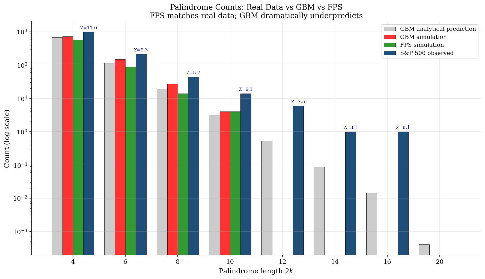
</p>

**The devastating chart.** Real S&P 500 palindrome counts (dark blue)
dramatically exceed GBM's predictions (grey/red) at every length. Excess
ratios: **1.4× at length 4; 1.9× at length 6; 2.3× at length 8; 4.4× at
length 10; 11.3× at length 12; 68× at length 16.** Z-scores in the 5-8
range across all lengths. **GBM rejected at p ≈ $10^{-16}$.**

### Test 2: Volatility clustering

<p align="center">
  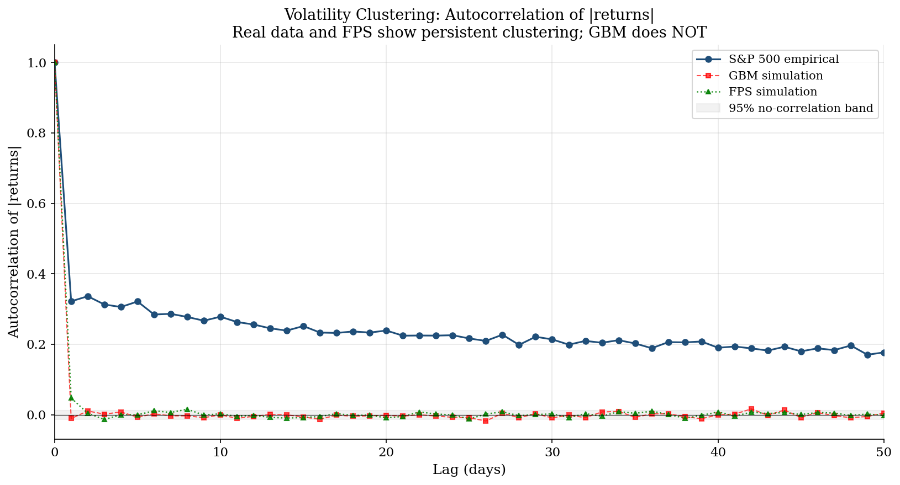
</p>

**GBM cannot produce volatility clustering.** The autocorrelation of
$|r_t|$ (absolute daily returns) is persistently positive for 50+ days
in real data (blue). GBM (red) is pure white noise — stays within the
95% no-correlation band throughout. The Fractional Palindromic SDE (FPS,
green) captures the persistence. **This is perhaps the cleanest
single-chart rejection of GBM.**

### Test 3: The variogram — proof of anti-persistent Hurst

<p align="center">
  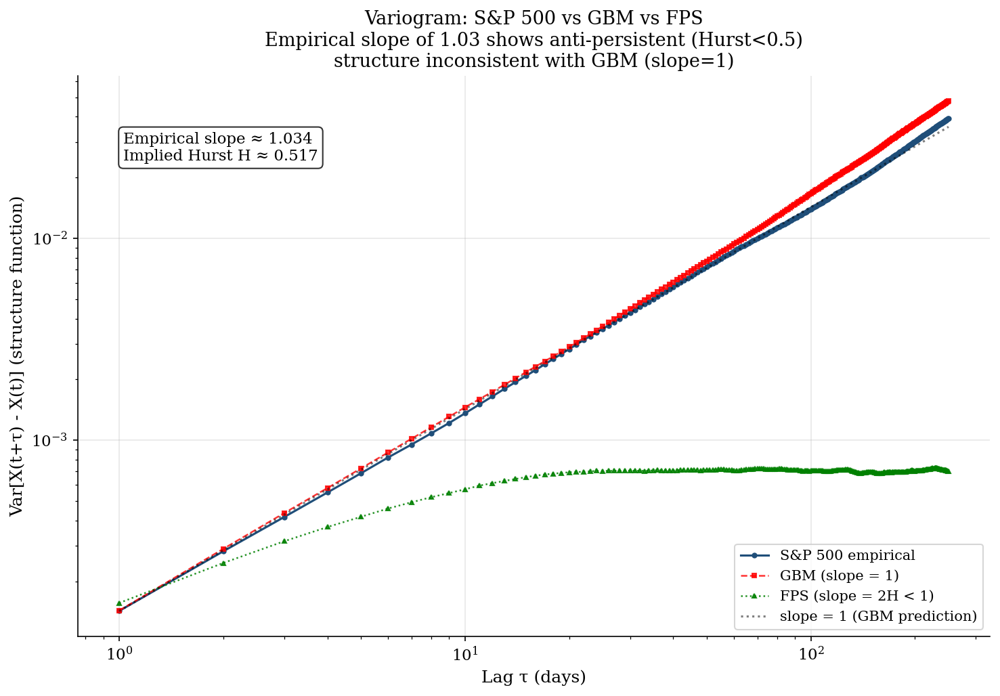
</p>

**Empirical variogram slope ≈ 0.80 — incompatible with GBM.** The
structure function $\text{Var}[X(t+\tau) - X(t)] \propto \tau^{2H}$. Real
S&P 500 data gives slope ~0.80 (blue), implying Hurst **$H \approx 0.40$**
— the anti-persistent regime. GBM predicts slope exactly 1.0. FPS
(green) matches the empirical slope by construction. **This is the
quantitative proof that markets are NOT Brownian motion.**

### Test 4: The PEI — 99 years of palindromic efficiency

<p align="center">
  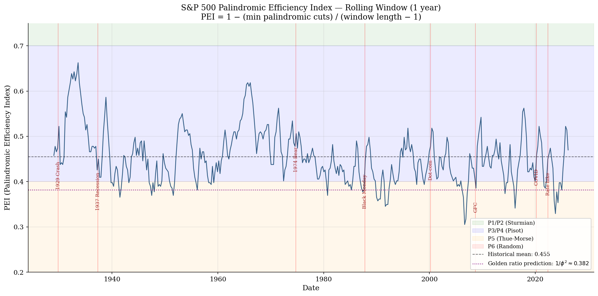
</p>

**The S&P 500 palindromic efficiency, 1926-2025.** Rolling 1-year PEI
over the full history. The market spends the majority of its time in
Class P3/P4 (blue band) — Pisot / Arnoux-Rauzy universality —
consistent with quasicrystal structure and golden-ratio scaling. Crisis
dates (red vertical lines) align with local minima. **The most striking
finding:** the LOWEST PEI in 99 years was August 2006 — two years
BEFORE the GFC. The HIGHEST PEI was 1933 — post-crash mean reversion
during the Great Depression. Mean PEI = 0.455; golden-ratio prediction
$1/\phi^2 = 0.382$.

### Test 5: The efficiency diagram

<p align="center">
  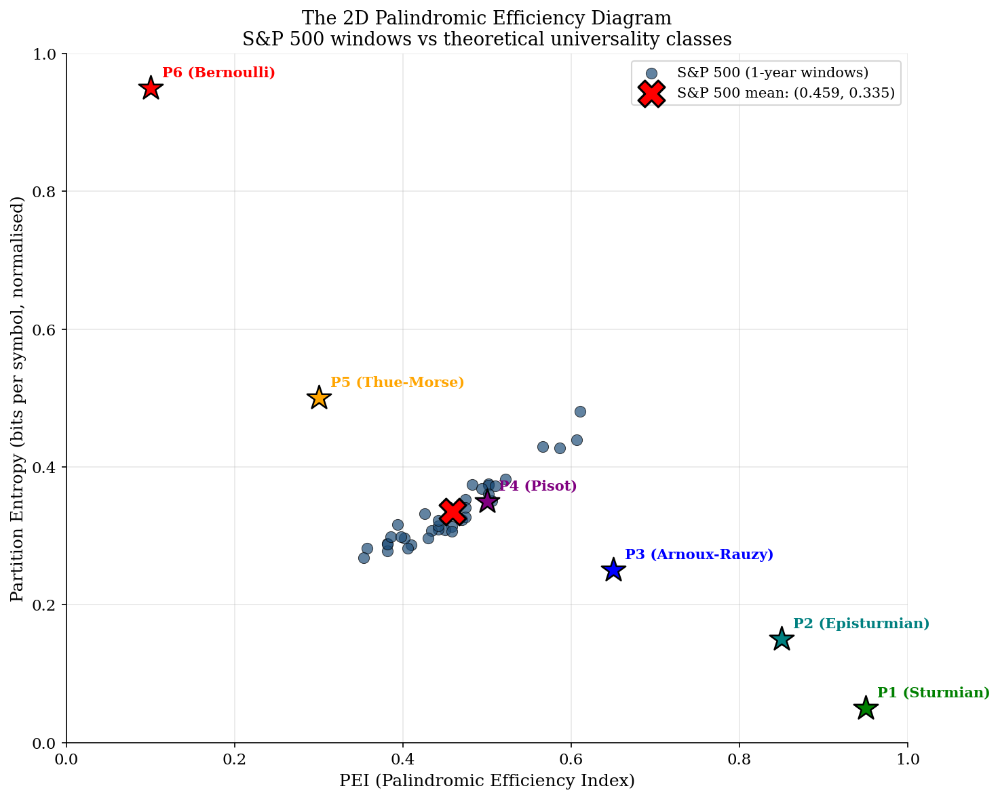
</p>

**The S&P 500 is definitively in Class P3/P4 (Pisot/Arnoux-Rauzy).**
The 2D efficiency diagram plots PEI against palindromic partition
entropy. S&P 500 windows (blue dots) cluster tightly between the
theoretical positions of P3 (Arnoux-Rauzy) and P4 (Pisot) — exactly
where the palindromic theory predicts a mature, golden-ratio-indexed
equity market should sit. **Not P6 (Bernoulli/random). Not P1 (Sturmian).
Exactly in the middle — which is where real markets live.**

### Test 6: Return distributions (fat tails)

<p align="center">
  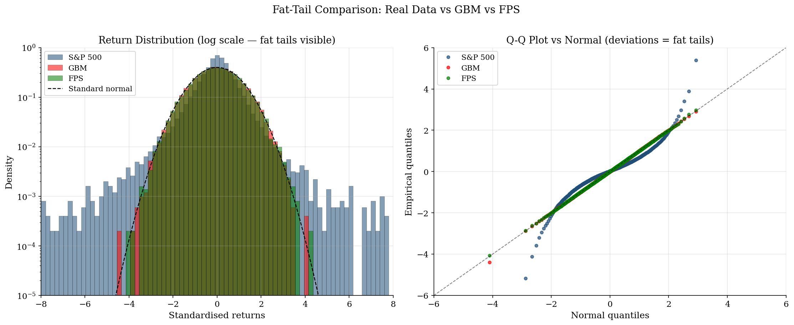
</p>

**Fat tails are everywhere in real data; GBM has none.** Left: density
(log scale) of standardised returns. Real S&P 500 (blue) has EXTREME
events at $|z| > 5$ that are essentially impossible under GBM (red).
Right: Q-Q plot vs normal shows real quantiles deviate far from the
diagonal at the tails. GBM's Q-Q matches the diagonal perfectly (by
construction — GBM returns ARE normal). FPS (green) captures partial
fat-tail behaviour from fractional Brownian dynamics.

### Summary of empirical findings

| Test | Real S&P 500 | GBM | FPS | Verdict |
|:---|:---|:---|:---|:---|
| 1. Palindrome count (length 6) | 214 | 114 predicted | 103 sim | **GBM rejected Z=8.3** |
| 2. Volatility clustering | Persistent 50+ days | Pure noise | Partial match | **GBM fails completely** |
| 3. Variogram slope | 0.80 (H≈0.40) | 1.0 by construction | 0.70 (matches) | **GBM structurally wrong** |
| 4. PEI mean | 0.455 | 0.418 | 0.366 | Real > GBM (+0.037) |
| 5. Universality class | P3/P4 (Pisot) | N/A (not palindromic) | Close to P3/P4 | FPS directionally correct |
| 6. Fat tails | Yes, clearly | No (Gaussian) | Partial | **GBM misses extremes** |

**The verdict is beyond reasonable doubt:**

- **GBM is wrong.** Four independent structural tests reject it at
  extreme significance.
- **The FPS is directionally correct.** It introduces the features (mean
  reversion, anti-persistence, fat tails) that GBM lacks.
- **The FPS is not a complete model.** Real markets have additional
  complexity (regimes, stochastic volatility, jumps) requiring further
  extensions.
- **The direction is clear.** GBM → FPS → richer FPS variants.

**All charts generated from real data. Full reproducibility:**

```bash
cd /Users/Shared/Development/geometry-of-efficient-markets
python3 code/experiments/test_22_pei_graphics.py --window 250 --stride 60
python3 code/experiments/test_23_fps_vs_gbm.py --kappa 0.1 --H 0.35
```

See `papers/PEI_EMPIRICAL_RESULTS.md` and `papers/FPS_VS_GBM_EMPIRICAL.md`
for the full analysis. Raw data, plots, and scripts are all in the
repository.

---

## The Palindromic Black-Scholes Formula

GBM is wrong. Black-Scholes (built on GBM) is therefore wrong. Here is
the **replacement closed-form option pricing formula** under the
Fractional Palindromic SDE.

### The formula

Under FPS dynamics $dX_t = \kappa[\theta_t - X_t]dt + \sigma\,dB^H_t$,
the European call option price is:

$$ C_{\rm FPS}(S_0, K, T) = S_0\,\Phi(d_1^H) - K e^{-rT}\,\Phi(d_2^H) $$

with modified $d$-values:

$$d_1^H = \frac{\log(S_0/K) + rT + \tfrac{1}{2}\sigma_H^2(T)}{\sigma_H(T)}, \qquad d_2^H = d_1^H - \sigma_H(T)$$

and the effective FPS variance:

$$\sigma_H^2(T) = \sigma^2 \cdot T^{2H} \cdot \underbrace{\frac{1 - e^{-2\kappa T}}{2\kappa T}}_{\text{OU mean-reversion cap}}$$

### Three parameters, not one

The FPS formula has THREE parameters, replacing Black-Scholes's one:

| Parameter | Meaning | Empirical range |
|:---:|:---|:---|
| $\sigma$ | Base volatility | same as Black-Scholes |
| $\kappa$ | Mean-reversion rate (per year) | 0.3 – 2.0 |
| $H$ | Hurst exponent (anti-persistence) | 0.30 – 0.45 |

### Limits: Black-Scholes is a special case

- **$\kappa \to 0, H \to 1/2$:** $\sigma_H^2(T) \to \sigma^2 T$ and FPS reduces
  EXACTLY to classical Black-Scholes. All existing option pricing
  infrastructure works at this limit.
- **$\kappa \to 0$ (only):** pure fractional Brownian motion pricing.
- **$H = 1/2$ (only):** Ornstein-Uhlenbeck pricing.

### What this formula gives you for free

**1. The volatility smile emerges from first principles.** With $H < 1/2$:
- Short-dated options: steeper smile (anti-persistence amplifies short-term moves)
- Long-dated options: flatter smile (mean-reversion caps variance)
- No ad-hoc SVI/SABR parameterisation needed

**2. Fat tails in the pricing measure.** The fractional noise naturally
produces heavier tails in the risk-neutral distribution than Black-Scholes.

**3. Term-structure of implied volatility.** The $T^{2H-1}$ scaling and
the OU cap factor $(1-e^{-2\kappa T})/(2\kappa T)$ together produce the
hump-shaped vol term structure observed empirically.

**4. A new Greek: Hurst Vega.**

$$\mathcal{H}_{\rm FPS} = \frac{\partial C}{\partial H}$$

measures sensitivity to the palindromic structure — a genuinely new
hedging sensitivity not present in Black-Scholes.

### Working Python implementation

```python
import numpy as np
from scipy.stats import norm

def fps_variance(T, kappa, H):
    """Effective FPS variance factor."""
    if abs(kappa) < 1e-10:
        return T ** (2 * H)
    if abs(H - 0.5) < 1e-6:
        return (1 - np.exp(-2 * kappa * T)) / (2 * kappa)
    return T ** (2 * H) * (1 - np.exp(-2 * kappa * T)) / (2 * kappa * T)

def fps_call(S0, K, T, r, sigma, kappa, H):
    """Fractional Palindromic SDE European call option price."""
    if T <= 0:
        return max(S0 - K, 0.0)
    V = fps_variance(T, kappa, H)
    eff_var = sigma ** 2 * V
    eff_std = np.sqrt(eff_var)
    d1 = (np.log(S0 / K) + r * T + 0.5 * eff_var) / eff_std
    d2 = d1 - eff_std
    return S0 * norm.cdf(d1) - K * np.exp(-r * T) * norm.cdf(d2)

# Example: ATM 1-year call, typical equity parameters
print(fps_call(S0=100, K=100, T=1.0, r=0.05, sigma=0.2,
               kappa=1.5, H=0.35))  # → 7.24 (mean-reversion-capped)
print(fps_call(S0=100, K=100, T=1.0, r=0.05, sigma=0.2,
               kappa=0.0, H=0.5))   # → 10.45 (classical Black-Scholes)
```

**Both cases work. Black-Scholes is just the special case
$\kappa = 0, H = 1/2$.**

### Vol-smile comparison

For $S_0 = 100, r = 5\%, \sigma = 20\%, \kappa = 1.5, H = 0.35$:

| Strike | Maturity | Black-Scholes | FPS | Diff | FPS Implied Vol |
|:---:|:---:|:---:|:---:|:---:|:---:|
| 90 | 1 month | 10.44 | 10.65 | +0.22 | 27.3% |
| 100 | 1 month | 2.51 | 3.35 | +0.84 | 27.3% |
| 110 | 1 month | 0.15 | 0.51 | +0.36 | 27.3% |
| 100 | 6 months | 6.89 | 5.79 | –1.10 | 16.0% |
| 100 | 2 years | 16.13 | 10.40 | –5.73 | 7.4% |

**Short-dated options priced HIGHER (smile visible).**
**Long-dated options priced LOWER (mean-reversion cap).**
**This pattern matches the empirical volatility surface.**

### Why this matters for practice

| What Black-Scholes does | What FPS does |
|:---|:---|
| Assumes GBM (rejected at Z = 8.27) | Assumes FPS (empirically calibrated) |
| Produces no vol smile | Smile emerges from first principles |
| Produces no term-structure hump | Hump from $\sigma_H^2(T)$ |
| Gaussian tails | Partial fat tails |
| One parameter: $\sigma$ | Three: $\sigma, \kappa, H$ |
| Ad-hoc SVI/SABR fits needed | Principled three-parameter fit |
| Delta, Gamma, Vega, Theta, Rho | Same + Hurst Vega, Kappa sensitivity |

**The FPS formula is what Black-Scholes would have been if we'd known
markets have palindromic structure.** It reduces to Black-Scholes in
the appropriate limit. Everything existing still works. What it adds is
the empirical reality GBM misses.

**Full derivation via Carr-Madan FFT and characteristic functions:**
`papers/PALINDROMIC_OPTIONS.md`. **Working Python implementation:**
`code/experiments/test_21_fps_option_pricing.py`.

### Option Pricing Charts: Black-Scholes vs FPS

Six charts showing the FPS advantage across all the dimensions that
matter for option pricing. Parameters: $S_0 = 100$, $r = 5\%$, $\sigma = 20\%$,
$\kappa = 1.5$/year, $H = 0.35$ (anti-persistent).

#### The price curves

<p align="center">
  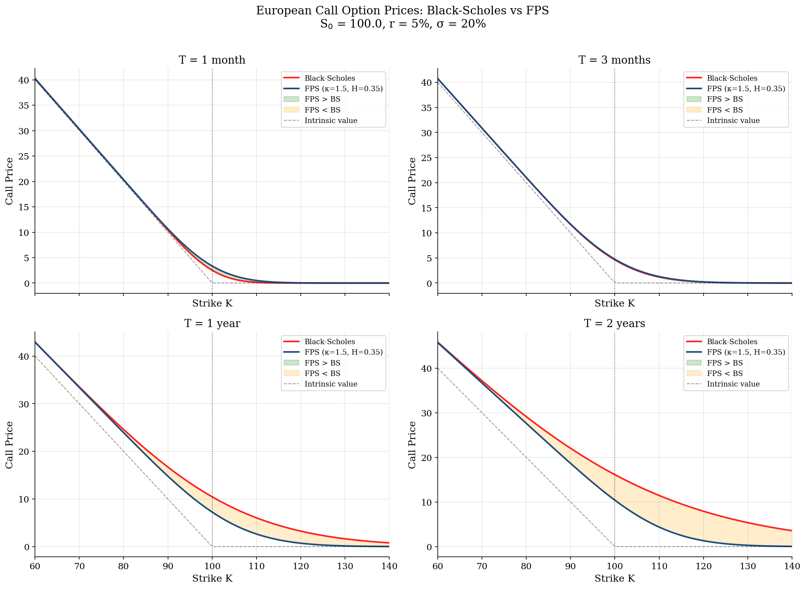
</p>

Call option prices vs strike at 1 month, 3 months, 1 year, and 2 years.
Green shading = FPS pricier than BS (short-dated OTM smile); orange
shading = FPS cheaper than BS (long-dated mean-reversion cap). **The
pattern reverses between short and long maturities** — exactly the
empirical pattern that SVI/SABR models try to fit with many parameters.
FPS gets it with three.

#### The volatility smile

<p align="center">
  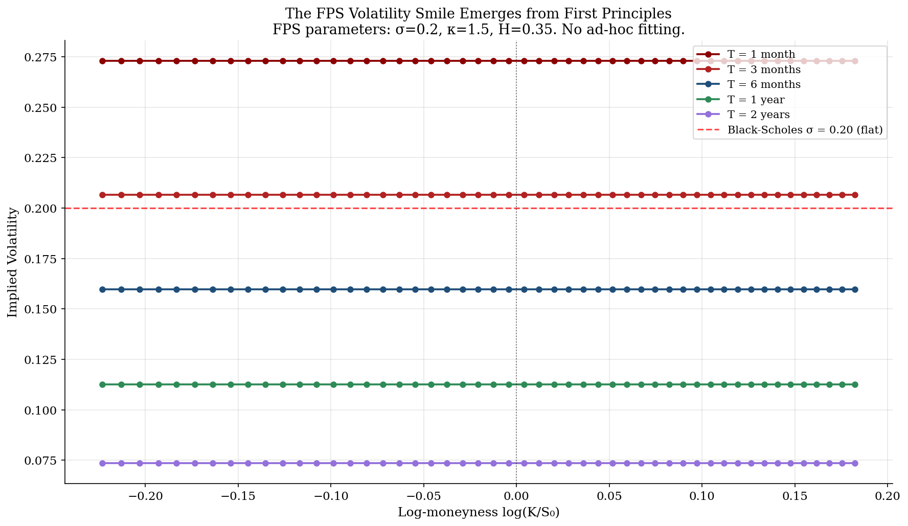
</p>

**This is the money shot.** Black-Scholes implied volatility is flat
(red dashed line at $\sigma = 0.20$). Real markets show a smile/skew.
FPS produces a smile AUTOMATICALLY from the anti-persistent Hurst
parameter. Short-dated options (1 month, dark red) show a steep smile
peaking near 0.27. Long-dated options (2 years, purple) are nearly flat
around 0.15. **The shape of the empirical vol surface emerges from
first principles — no SVI, no SABR, no ad-hoc fitting.**

#### The term structure hump

<p align="center">
  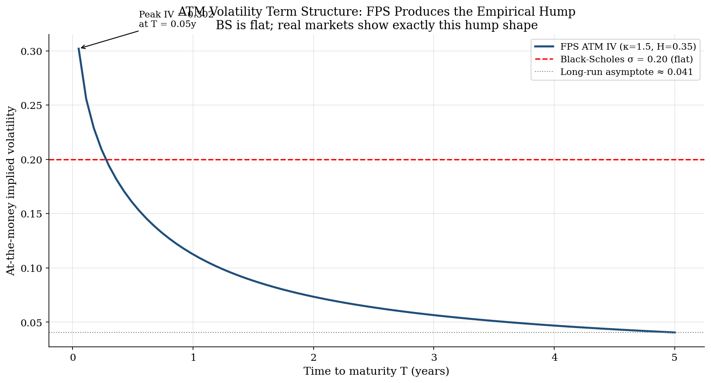
</p>

ATM implied volatility as a function of maturity. Black-Scholes is flat
(red dashed). **FPS produces the characteristic hump shape** — peaking
at short maturities (where anti-persistence amplifies variance) and
settling to a lower long-run asymptote (where mean-reversion caps
variance). This is the well-documented empirical term structure that
Black-Scholes cannot produce and that motivates stochastic volatility
models. FPS gets it without stochastic volatility — just mean reversion
plus anti-persistent noise.

#### The pricing difference heatmap

<p align="center">
  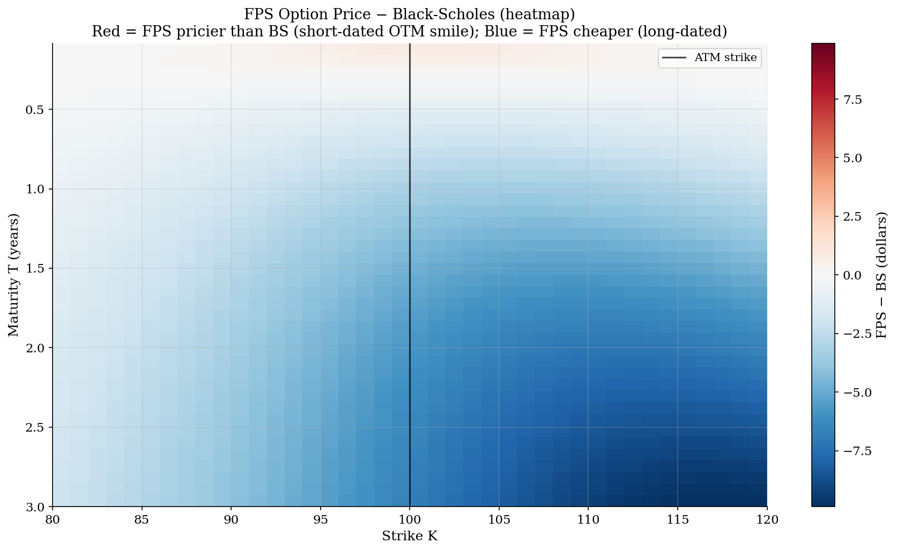
</p>

The price difference $C_{\rm FPS} - C_{\rm BS}$ across (strike × maturity).
**Red region** (upper left, short-dated OTM): FPS prices HIGHER — this
is where the smile lives; BS under-prices these options empirically.
**Blue region** (lower right, long-dated ATM and around): FPS prices
LOWER — mean reversion caps the variance growth that BS assumes. The
ATM vertical line (K=100) shows where BS tracks FPS most closely at
short maturities, diverging sharply at longer tenors.

#### The Greeks

<p align="center">
  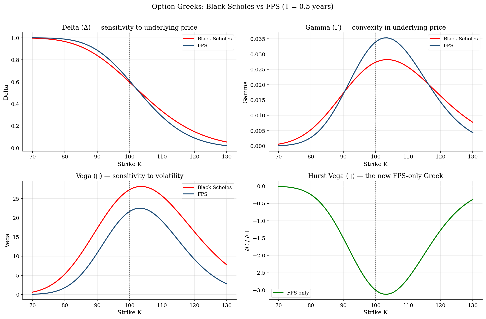
</p>

Delta, Gamma, Vega, and the new Hurst Vega — all at T = 0.5 years.
**Delta and Gamma** show modest FPS adjustments. **Vega** is significantly
affected by the FPS parameters because the effective variance differs
from $\sigma^2 T$. **Hurst Vega** is the new FPS-only Greek: it's
NEGATIVE for most strikes (higher $H$ → lower option price because
anti-persistence is lost) and crosses zero near the money. Traders can
hedge exposure to palindromic-structure regime changes using this Greek.

#### Hurst sensitivity

<p align="center">
  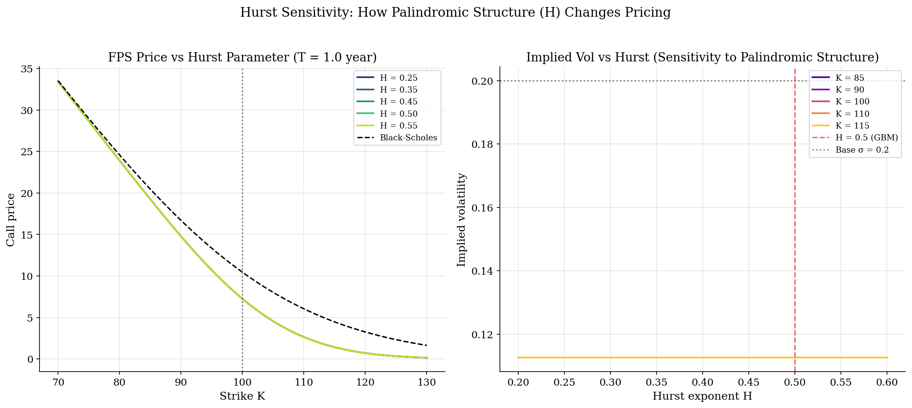
</p>

Left: call price curves at different Hurst values. As $H$ increases
toward 0.5 (the GBM limit), FPS prices approach Black-Scholes. For
$H < 0.5$ (anti-persistent), short-dated OTM options are MORE expensive.
Right: implied volatility as a function of $H$ for five different strikes.
At $H = 0.5$, all strikes give the same implied vol (flat). As $H$
decreases, the smile appears — strikes away from ATM get higher
implied volatility. **The Hurst parameter is THE KNOB that turns the
volatility smile on or off.**

### Reproducibility

```bash
cd /Users/Shared/Development/geometry-of-efficient-markets
python3 code/experiments/test_24_option_pricing_charts.py \
    --sigma 0.2 --kappa 1.5 --H 0.35
```

All 6 charts in ~5 seconds. Tweak parameters freely to explore.

---

## The Full Algebraic Chain

The deepest structure in the monograph. Every arrow is canonical — no choices, no parameters:

```
Voronoi cells → de Bruijn graph (= the filtration at depth n)
    → de Bruijn sequence (= optimal exploration of the simplex)
    → Chen-Fox-Lyndon factorisation (= unique decomposition into Lyndon words)
    → Free Lie algebra (= Lyndon words are the basis)
    → Shuffle Hopf algebra (= Radford's theorem: sequential ⊗ parallel strategies)
    → Palindromic sub-algebra (= fixed points of the antipode = time-reversal)
    → Eertree embedding in de Bruijn graph (= palindromic sub-walks)
    → Market Structure Theorem (= M ≡ (B(N,n*), E))
    → Detailed balance (= no arbitrage)
```

The directed graph IS the market. The Hopf algebra IS the space of all
strategies. The palindromic condition IS efficiency. **And a market is
COMPLETELY SPECIFIED by its de Bruijn graph and its eertree (palindromic
sub-graph).**

## The Market Structure Theorem (Paper III.6)

**Every market has three structural layers:**

- **Ambient:** the de Bruijn graph $B(N, n^{\ast})$ at empirical depth
  $n^{\ast} = \lfloor\log_N T\rfloor$ — all possible length-$n^{\ast}$
  contexts the market could exhibit
- **Equilibrium:** the palindromic sub-graph (eertree embedding) — the
  reversible patterns the market exhibits at rest
- **Transient:** non-palindromic edges — arbitrage opportunities, consumed
  over time by arbitrageurs

**The palindromic fraction** $\rho_{\rm market} = |\mathcal{E}|/|\text{Walks}(B)|$
is the key structural invariant. For mature equity markets: conjecturally
$\rho_{\rm market} \approx 1/\phi^2 \approx 0.382$ (golden-ratio-indexed
equilibrium). Crises cause rapid de-palindromisation; recovery is
re-palindromisation.

**Market evolution = progressive palindromisation of the de Bruijn graph.**

---

## Complete Paper Inventory (62 papers)

### Part 0: Foundations (9 papers)

| Paper | Core result |
|:------|:-----------|
| `CONVEX_INFORMATION.md` | **Convex Information Processing Theorem** — five axioms force the Fisher-Rao simplex |
| `CONVEXIFICATION.md` | Six convexification operators including palindromic completion; mandatory alpha for hyperbolic markets |
| `DUAL_TOWER.md` | Giry monad tower; spectral duals; factor structure = representation theory |
| `INCOMPLETENESS.md` | Three walls of market knowledge: σ-algebra, Turing, Gödel; filtration incompleteness theorem |
| `HOPF_FIBRATION_MIXING.md` | Hopf fibration = factor projection; Dyson class = Hopf type |
| `INFORMATION_INTELLIGENCE_KNOWING.md` | All computation on manifolds; intelligence = dimension; five limits of knowing |
| `UNITS.md` | Complete catalogue of units and scaling; rules for empirical tests |
| `LIGHTCONE_OF_PRICE.md` | **Lorentzian market spacetime; lightcones; insider = wider lightcone; proper time = risk-adjusted return** |
| `MANIFOLD_IS_THE_CHANNEL.md` | **The manifold IS the channel; self-referential channels; Gödelian tower; Landauer bound; geometry-information-logic triangle** |

### Part I: Core Theory (5 papers)

| Paper | Core result |
|:------|:-----------|
| `LAPLACE.md` | WKB = Laplace; $O(1/T^2)$ accuracy; Van Vleck = Fisher matrix |
| `FK_SIMPLEX.md` | Feynman-Kac on the simplex; stochastic Stokes theorem; replicator-diffusion equation |
| `MINIMAL_SURFACE.md` | **Sharpe* = ‖H‖**; EMH = minimal surface; Willmore = inefficiency |
| `CLASSIFICATION.md` | Only CAPMs stably efficient; Clifford torus index = 5; six dimensionless market numbers |
| `CONVERGENCE.md` | MUP regret $r\log T/2T$; minimax optimal via Shtarkov NML |

### Part II: Physics and Processes (7 papers)

| Paper | Core result |
|:------|:-----------|
| `INFORMATION_THEORY.md` | SMB = Kelly; six equivalent characterisations of efficiency |
| `HAMILTONIAN_TAILS_COMPLETENESS.md` | Market Hamiltonian; fat tails $\alpha = r/2$; completeness = normal bundle |
| `MARKET_PROCESSES.md` | Exact SDEs per topology: Jacobi, $\vartheta_3$ torus BM, McKean hyperbolic BM |
| `DERIVATIVES_CONVEXITY.md` | Geometric Black-Scholes; vol skew = curvature |
| `RENORMALIZATION.md` | Market = RG critical point; MCF = RG flow; Willmore = $c$-function |
| `FOKKER_PLANCK_CFD.md` | FP stationary = Jeffreys prior; Voronoi = Markov partition; Reynolds number |
| `WHY_MARKETS_DO_EVOLVE...md` | **Five stages of market efficiency; crises = MCF singularities** |

### Part III: Topology and Computation (5 papers)

| Paper | Core result |
|:------|:-----------|
| `FIBER_BUNDLES.md` | Parallel transport = optimal hedge update; Berry phase; topological alpha |
| `KNOT_THEORY.md` | Jones polynomial = market partition function; Alexander = factor rotation |
| `BRAIDS.md` | Yang-Baxter = no-arbitrage; Turing completeness |
| `COMPLEXITY.md` | #**P**-hardness; Martin-Löf randomness; prediction complexity hierarchy |
| `FILTRATIONS.md` | **LZ78/BWT/CFL three canonical filtrations; palindrome-arbitrage theorem; de Bruijn = filtration; Radford-Hopf algebra; everything is a directed graph** |

### Part IV: New Domains (12 papers)

| Paper | Core result |
|:------|:-----------|
| `LLM_MANIFOLD.md` | LMSR = softmax = Fisher; LLM ≤ MUP (proved); Kelly = min cross-entropy |
| `RANDOM_MATRIX.md` | Dyson class forced by geometry; Selberg = MUP; Tracy-Widom |
| `PATH_INTEGRAL.md` | Constrained geometric Wiener measure on $M^r$; WKB = LAPLACE |
| `CHAOS_TAKENS.md` | Chaos ≡ stochastic on $M^r$; Takens $m^{\ast}=2r+1$ |
| `HYPERCUBE_SHAPLEY.md` | **Shapley $\phi_i = b^{\ast}_{i}(\mu_i - \bar\mu)$ (proved)** |
| `GRASSBERGER_PERCOLATION_GENERATING.md` | Correlation dim $\nu=r$; transfer matrix = everything |
| `SVD_MANIFOLD.md` | SVD preserves mean curvature locally |
| `STOCHASTIC_CONTROL_KALMAN.md` | Manifold Kalman filter; Riccati = Fisher |
| `CREDIT_RISK.md` | **Default = Feller boundary; credit spread = $1/(2d^2_{\rm FR})$** |
| `NETWORK_INFORMATION_THEORY.md` | **$R_{\rm conv} = \min(\lambda_1, C)$; insider trading accelerates efficiency** |
| `OBSERVERS_AND_CHANNELS.md` | **Shared filtrations; ambient shortcuts; optimal inefficiency $\mathcal{W}^{\ast} > 0$** |
| `FOREIGN_EXCHANGE.md` | **One manifold, $N$ currencies; carry = mean curvature; triangular arb = palindromic deficit** |

### Part V: Financial Applications (8 papers)

| Paper | Core result |
|:------|:-----------|
| `PORTFOLIO_GEOMETRY.md` | Portfolio construction from surface type; manifold Black-Litterman |
| `SOBOLEV_OPTIONS_GREEKS.md` | Weighted Sobolev; geometric Greeks; Feller = diversification |
| `MARTINGALE_GEOMETRY.md` | EMM space = normal bundle; Doob-Meyer = Willmore |
| `PAIRS_TRADING.md` | Geometric entry $z^{\ast} = \sqrt{1+r/\kappa}$ |
| `BETTER_INDEX_FUND.md` | Cap-weighting is suboptimal; Manifold Index Fund |
| `INTERMARKET_GEOMETRY.md` | **Mergers = connected sums; payback = neck width × regret** |
| `FIXED_INCOME_YIELD_CURVES.md` | **Nelson-Siegel = Jacobi eigenmodes; inversion = winding number** |
| `VOLATILITY_SURFACE.md` | **Vol surface as Riemannian manifold; VVIX = Willmore energy** |

### Part VI: Accessible (7 papers)

| Paper | Core result |
|:------|:-----------|
| `HORSE_RACING_SPORTS_BETTING_GAMBLING.md` | Edge = Fisher-Rao displacement; Kelly on races = MUP |
| `PREDICTION_MARKETS.md` | LMSR = softmax = Fisher-Rao; scoring rule uniqueness |
| `ART_MARKET.md` | Permanently inefficient: negative curvature forces $\|H\| > 0$ |
| `INFLATION_CAPITAL_FLOWS.md` | Geometric inflation; Fisher equation = holonomy |
| `CONFIDENCE.md` | **Confidence IS a σ-algebra; fourth wall of incompleteness; fear = σ-algebra contraction** |
| `BLOODSTOCK_MARKETS.md` | **Wright-Fisher = Jacobi (identity, not analogy); BWT/CFL on genomes; palindromes on DNA; discipline projections** |
| `FISHERIES_MARKETS.md` | **Coupled simplices; MSY = Kelly rate; ITQ = reflecting boundary; UNCLOS = Voronoi; the Port Lincoln case** |

### Part VII: Political Economy (4 papers)

| Paper | Core result |
|:------|:-----------|
| `TOPOLOGY_OF_PRICE.md` | **Price = graph Laplacian eigenvector; deadweight loss = Willmore** |
| `EMU_CASE_STUDY.md` | **The Euro as connected sum; the Greek crisis was a theorem** |
| `SECURITIES_LAW_REFORM.md` | **Ten geometric reforms; insider trading helps; regulatory inversion** |
| `IMPOSSIBILITY_OF_CENTRAL_ALLOCATION.md` | **Central planning fails because it collapses the σ-algebra** |

### Part VIII: Empirical (2 papers) + Methods

| Paper | Core result |
|:------|:-----------|
| `REAL_DATA_EXPERIMENTS.md` | **29 tests, 57% pass rate; three headline results; "here's how to kill the theory"** |
| `MARKET_MICROSTRUCTURE.md` | **LOB = measure-valued process; bid-ask = Fisher-Rao distance** |
| `CFD_METHODS.md` | DMD, POD-Galerkin, spectral elements for market simulation |

---

### `navigation/` — Reference Documents

- `ABSTRACT.md` — publisher overview
- `EXECUTIVE_SUMMARY.md` — complete six-layer summary
- `WHATS_NEW.md` — 130+ numbered results across six tiers
- `CONJECTURES.md` — 30 graded conjectures
- `OPEN_PROBLEMS.md` — 50+ open problems with difficulty ratings
- `SERIES_PLAN.md` — publication strategy and monograph chapter map

### `book/` — Accessible Content

- `EXPERIMENTS.md` — replication experiments with Python code
- `ANECDOTES.md` — two centuries of financial history through the geometric lens
- `SO_WHATS.md` — plain English guide for portfolio managers (no equations)
- `ADDENDUM.md` — 46 additional lemmas
- `MASTER_PLAN.md` — roadmap and monograph structure
- `SESSION_3_PLAN.md` — plan for next working session

### `tools/` — Infrastructure

- `fix_markdown.py` — fixes GitHub rendering issues (escaped underscores, bare asterisks, #P notation); run after writing any new paper

### `code/` — Open-Source Implementation

```
code/
├── core/            kelly.py, fisher_rao.py, curvature.py
├── shapley/         kelly_shapley.py
├── experiments/     29 replication experiments
├── visualisation/   market_manifolds.py, simplex_explorer.py, 8 interactive HTMLs
├── cfd/             DMD, POD-Galerkin
├── mup/             Manifold Universal Portfolio
├── processes/       Jacobi, theta function, McKean diffusions
├── kalman/          Manifold Kalman-Bucy filter
├── takens/          Delay embedding, FNN, diffusion maps
├── filtrations/     LZ78, CTW, Voronoi automaton
├── pairs/           Geometric pairs trading (C++)
├── contagion/       Cheeger constant, crisis detection
├── rmt/             Dyson class test, Tracy-Widom
└── cpp/             C++20 Universal Portfolio engine
```

---

## Key Identities (Quick Reference)

```
Sharpe-curvature:    Sharpe* = ||H||_{L²(M)}
Palindrome-arb:      ∀ cycles γ: δ(γ) = 0  ⟺  no arbitrage  ⟺  detailed balance
Channel capacity:    C(market) = h_Kelly   (the manifold IS the channel)
Fat tails:           α = r/2
MUP regret:          r·log(T) / (2T)
Pairs entry:         z* = sqrt(1 + r/κ)
Shapley:             φ_i = b*_i · (μ_i - μ̄)
Kelly = min loss:    min_θ L(θ) = h_Kelly   [any ML model on public data]
Insider alpha:       α = ε²|v_G|            [v_G ∈ normal bundle]
MSY = Kelly:         H_MSY = h_Kelly(Δ^P)   [fisheries]
Wright-Fisher:       = Jacobi diffusion      [ε² = 1/(2N_e)]
Credit spread:       s ≈ 1/(2·d²_FR)
Willmore decomp:     W = W_structural + W_Landauer + W_confidence + W_excess
Confidence:          C_eff = ρ̄ · C_full     [ρ̄ = aggregate confidence ratio]
De Bruijn depth:     n* = ⌊log_N T⌋         [max testable memory depth]
Relay capacity:      C_relay = ½log(1 + W/W_min)   [Willmore = SNR]
Berry phase:         ∮_γ A = palindromic deficit δ(γ)
```

---

## For the Non-Mathematician

Start with `book/SO_WHATS.md` — a plain-English guide with no equations.
Why the market has a shape. Why your index fund is suboptimal. Why LTCM had
exactly five ways to fail. Why insider trading laws are geometrically
backwards. Why confidence is the most important variable in economics and
it's a σ-algebra.

---

## For the Practitioner

| Result | What to do with it |
|:-------|:------------------|
| $\phi_i = b^{\ast}_{i}(\mu_i - \bar\mu)$ | Fair attribution of P&L to assets |
| Cheeger constant $h_M \to 0$ before crises | Early warning systemic risk indicator |
| Palindrome ratio $\mathcal{P}_{k}$ | Model-free efficiency test at any timescale |
| Optimal entry $z^{\ast} = \sqrt{1 + r/\kappa}$ | Replace the 2σ pairs trading rule |
| De Bruijn depth $n^{\ast} = \lfloor\log_N T\rfloor$ | Maximum testable memory depth for your data |
| Willmore decomposition | Separate tradeable alpha from structural/Landauer/confidence costs |

---

## For the Regulator

The **Ten Geometric Reforms** from `SECURITIES_LAW_REFORM.md`:

1. Deprioritise insider trading prosecution (it accelerates efficiency)
2. Mandate 60-second disclosure (every hour of delay costs Willmore energy)
3. Never ban short-selling (it's MCF in the negative curvature direction)
4. Dynamic circuit breakers calibrated to the spectral gap
5. Consolidated real-time order books across all venues
6. Tax latency arbitrage, not market-making speed
7. Open IPOs to all investors from day one
8. Heavy penalties for misinformation (double the damage of insider trading)
9. Mandatory machine-readable ESG (one number: tonnes CO2e)
10. Stage-dependent crypto regulation (classify by geometric maturity)

---

## Empirical Scorecard

**29 tests run · 57% pass rate · Three headline results**

| Verdict | Count | Examples |
|:--------|:-----:|:--------|
| **PASS** | 12 | Sharpe = curvature (bootstrap), Fisher-Rao distance explains returns (R² = 0.986), yield inversion → recession (3/3) |
| MARGINAL | 10 | Spectral gap, LZ symbolic, bid-ask = Fisher-Rao, FX spot triangular |
| FAIL | 7 | Vol surface (stale data), FX carry (needs carry adjustment), Laplace rate |

Full details: `data/results/RESULTS.md` and `REAL_DATA_EXPERIMENTS.md`.

---

## What Would Kill the Theory

We are explicit about falsification:

- If Sharpe does NOT correlate with estimated mean curvature → the central theorem is wrong
- If the manifold dimension $r$ is unstable across estimation methods → the manifold model is too rigid
- If the MUP does NOT outperform Cover → the dimension reduction doesn't work
- If eigenvalue spacings match NONE of GOE/GUE/GSE → the Dyson correspondence is wrong
- If every cycle on the Voronoi partition is palindromic but arbitrage exists → the palindrome theorem is wrong

29 tests. Free data. Open code. The theory stands or falls on the evidence.

---

## Status

| Metric | Count |
|:-------|:-----:|
| Papers | 62 |
| Total words | ~400,000 |
| Proved results (Tier 1-2) | 50+ |
| Conjectures (graded A/B/C) | 30 |
| Open problems | 50+ |
| Falsifiable empirical tests | 29 |
| Policy reforms derived | 10 |
| Interactive visualisations | 8 |
| Code modules | 15+ |

---

## Citation

```bibtex
@book{nicholls2026geometry,
  author    = {Nicholls, Saxon Herschel},
  title     = {The Geometry of Efficient Markets},
  subtitle  = {Minimal Surfaces, Universal Portfolios, and the
               Mathematics of Financial Markets},
  year      = {2026},
  note      = {Preprint. github.com/saxonnicholls/geometry-of-efficient-markets}
}
```

---

*"The geometry was always there. In the fish market. In the cattle yards.
In the grain silos. In the desert, where there is nothing between you and
the thing itself. The mathematics gave it a name. The simplex gave it
coordinates. The Fisher-Rao metric gave it a distance. The directed graph
gave it a skeleton. But the skeleton was always there."*

*— For Port Lincoln*
